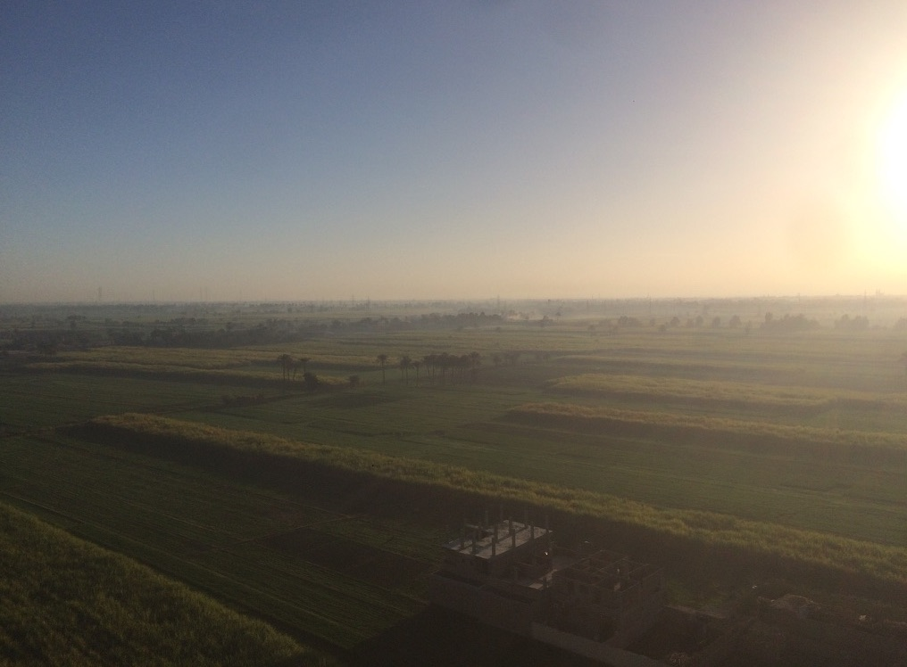
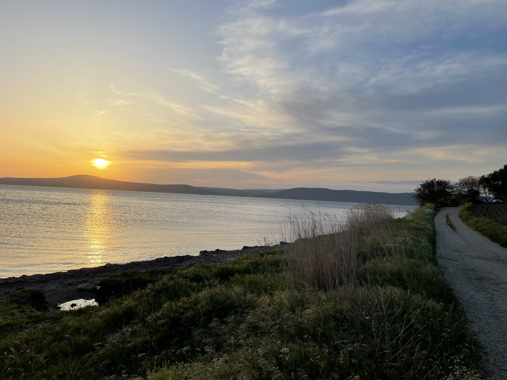
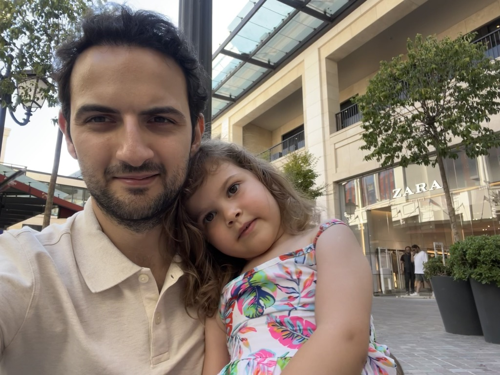
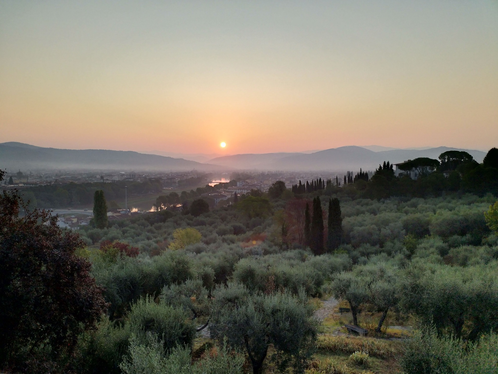
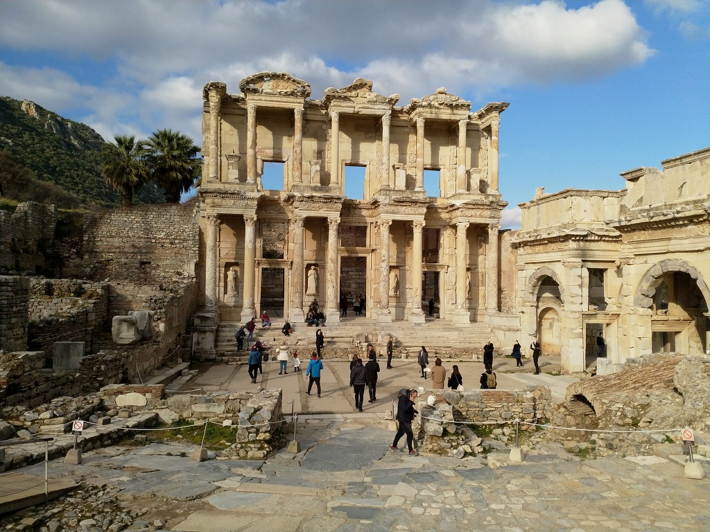
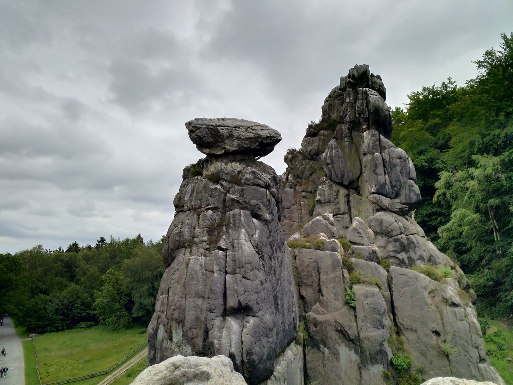

  
  
East Bank of the Nile, Luxor, Egypt.

  
  
A glimpse of home in Çanakkale, Turkey.

  
  
With my niece, mermaid Ipek, in Istanbul, Turkey.

  
  
Dawn's Golden Embrace Over the Meadows of Florence. Florence, Italy.

  
  
Iconic facade of the Library of Celsus, a testament to ancient Ephesian grandeur, Turkey.

  
  
The Externsteine, a testament to nature's artistry in Teutoburg forest, Germany

