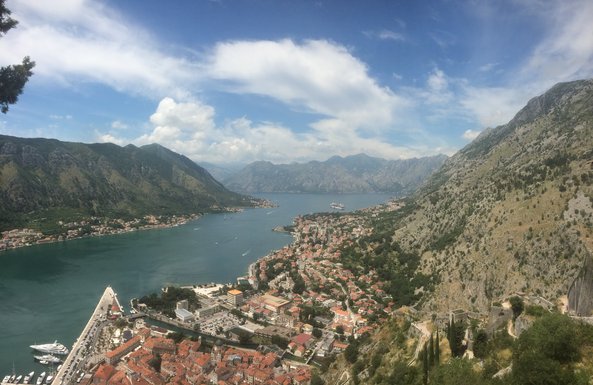

  
  
East Bank of the Nile, Luxor, Egypt.

  
  
A glimpse of home in Çanakkale, Turkey.

  
  
With my niece, mermaid Ipek, in Istanbul, Turkey.

  
  
Dawn's Golden Embrace Over the Meadows of Florence. Florence, Italy.

  
  
Iconic facade of the Library of Celsus, a testament to ancient Ephesian grandeur, Turkey.

  
  
The Externsteine, a testament to nature's artistry in Teutoburg forest, Germany

  
  
Stunning winter vista from Afyonkarahisar Castle, Turkey.

  
  
Iconic windmills of Zaanse Schans, Netherlands.

  
  
Beşiktaş JK's championship celebration, Istanbul.

  
  
Camel ride with the iconic Egyptian Pyramids backdrop, Egypt.

  
  
Panorama from Heidelberg Castle, overlooking the historic city, Germany.

  
  
Stunning vista from Masada, with the serene Dead Sea stretching into the horizon, Israel.

  
  
Breathtaking panorama from Kotor Castle, Montenegro.

  
  
Historic remnants of Persepolis, Iran.

  
  
Roman Forum, testament to Italy's ancient imperial grandeur, Italy.

